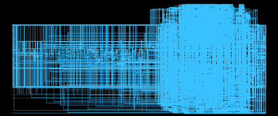

# ASIC-Design-for-Matrix-Vector-Computation
ASIC Design for Matrix-Vector Computation
# Matrix-Vector Multiplication ASIC (RTL Design)

## Overview of the System
This project implements a custom ASIC for matrix-vector multiplication:

\[
y = Wx
\]

where:

- \( W \) is an \( M \times N \) matrix
- \( x \) is an \( N \times 1 \) input vector
- \( y \) is an \( M \times 1 \) output vector

The design supports both 8-bit and 16-bit input values, while the output vector elements are represented using 48-bit precision.

The matrix \( W \) and vector \( x \) are fetched from external memory, which is not part of the ASIC.

In addition to core computation, the design integrates:
- **Sub-Word Sampling (SWS)**
- **ReLU activation function**

The system is implemented at the **Register Transfer Level (RTL)** using Verilog and follows a complete ASIC design approach, including datapath, control FSM, and memory interface.

### Schematic

### Layout

---

## Key Features
- Matrix-vector multiplication 
- 64-bit datapath architecture
- Integrated ReLU activation function
- Bit-level Sub-Word Sampling (SWS)
- Memory-mapped interface for inputs and outputs
- Modular RTL design (datapath + control)

---

## Architecture

### Datapath
The datapath includes:
- Register file (2 read / 1 write ports)
- 64-bit multiplier and adder
- Comparator and multiplexers
- SubWordSampler module
- ReLU module
